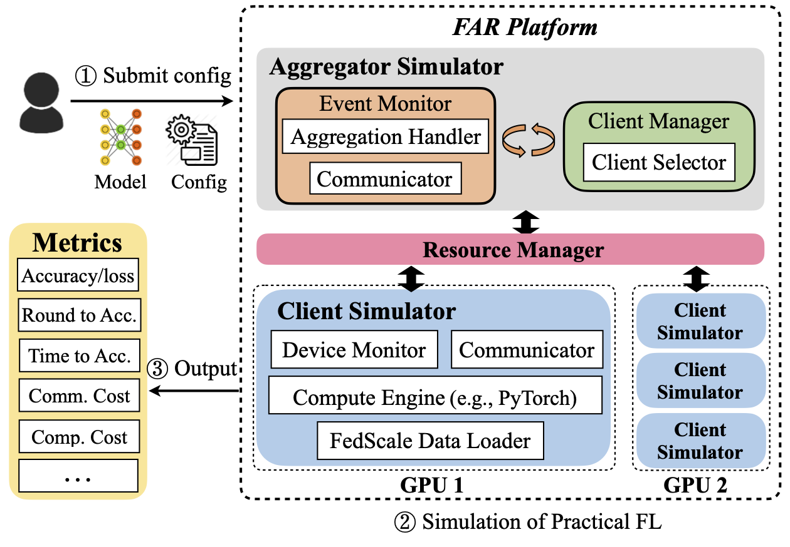

## FedScale: Benchmarking Model and System Performance of Federated Learning ([Paper](https://arxiv.org/abs/2105.11367))

This repository contains scripts and instructions of building FedScale, 
a diverse set of challenging and realistic benchmark datasets to facilitate scalable, comprehensive, 
and reproducible federated learning (FL) research. FedScale datasets are large-scale, encompassing a diverse range of important FL tasks, 
such as image classification, object detection, language modeling, speech recognition, and reinforcement learning. 
For each dataset, we provide a unified evaluation protocol using realistic data splits and evaluation metrics. 
To meet the pressing need for reproducing realistic FL at scale, we have also built an efficient evaluation platform, 
FedScale Automated Runtime (FAR), to simplify and standardize the process of FL experimental setup and model evaluation. 
Our evaluation platform provides flexible APIs to implement new FL algorithms and include new execution backends with minimal developer efforts.  

***FedScale is open-source with permissive licenses and actively maintained, 
and we welcome feedback and contributions from the community!***

## Overview

* [Getting Started](#getting-started)
* [Realistic FL Datasets](#realistic-fl-datasets)
* [Run Experiments with FAR](#run-experiments-with-far)
* [Repo Structure](#repo-structure)
* [Note](#acknowledgements)
* [Contact](#contact)

## Getting Started 

Our ```install.sh``` will install the following automatically:

* Anaconda Package Manager
* CUDA 10.2

Note: if you prefer different versions of conda and CUDA, please check  comments in `install.sh` for details.

Run the following commands to install FedScale. 

```
git clone https://github.com/SymbioticLab/FedScale
cd FedScale
source install.sh 
```

## Realistic FL Datasets

***We are adding more datasets! Please feel free to contribute!***

We provide real-world datasets for the federated learning community, and plan to release much more soon! Each is associated with its training, validation and testing dataset. A summary of statistics for training datasets can be found in Table, and you can refer to each folder for more details. Due to the super large scale of datasets, we are uploading these data and carefully validating their implementations to FAR. So we are actively making each dataset available for FAR experiments. 

CV tasks:

| Dataset       | Data Type   |# of Clients  | # of Samples   | Example Task | 
| -----------   | ----------- | -----------  |  ----------- |    ----------- |
| iNature       |   Image     |   2,295      |   193K        |   Classification |
| FMNIST        |   Image     |   3,400      |   640K        |   Classification  |    
| OpenImage     |   Image     |   13,771     |   1.3M        |   Classification, Object detection      |
| Google Landmark|  Image     |   43,484     |   3.6M        |   Classification       |
| Charades      |   Video     |    266       |   10K         |   Action recognition   |
| VLOG          |   Video     |    4,900     |   9.6k        |   Video classification, Object detection |

NLP tasks:

| Dataset       | Data Type   |# of Clients  | # of Samples   | Example Task | 
| -----------   | ----------- | -----------  |  ----------- |   ----------- |
| Europarl      |   Text      |   27,835     |   1.2M        |   Text translation  |
| Blog Corpus   |   Text      |   19,320     |   137M        |   Word prediction      |
| Stackoverflow |   Text      |   342,477    |   135M        |  Word prediction, classification |
| Reddit        |   Text      |  1,660,820   |   351M        |  Word prediction   |
| Amazon Review |   Text      | 1,822,925    |   166M        | Classification, Word prediction |
|  CoQA         |   Text      |     7,189    |   114K        |  Question Answering |
|LibriTTS       |   Text      |     2,456    |    37K        |   Text to speech    |
|Google Speech  |   Audio     |     2,618    |   105K        |   Speech recognition |
|Common Voice   |   Audio     |     12,976   |    1.1M       |   Speech recognition |

Misc Applications:

| Dataset       | Data Type   |# of Clients  | # of Samples   | Example Task | 
| -----------   | ----------- | -----------  |  ----------- |   ----------- |
|Taobao         |   Text      |     182,806  |    0.9M       |   Recommendation |
|Go dataset     |   Text      |     150,333  |    4.9M       |   Reinforcement learning | 

***Note that no details were kept of any of the participants age, gender, or location, and random ids were assigned to each individual. In using these datasets, we will strictly obey to their licenses, and these datasets provided in this repo should be used for research purpose only.***

Please go to `./dataset` directory and follow the dataset [README](https://github.com/SymbioticLab/FedScale/blob/master/dataset/README.md) for more details.

## Run Experiments with FAR
FedScale Automated Runtime (FAR), an automated and easily-deployable evaluation platform, to simplify and standardize the FL experimental setup and model evaluation under a practical setting. FAR is based on our [Oort project](https://github.com/SymbioticLab/Oort), which has been shown to scale well and can emulate FL training of thousands of clients in each round.




Please go to `./core` directory and follow the FAR [README](https://github.com/SymbioticLab/FedScale/blob/master/core/README.md) to set up FL training scripts.


## Repo Structure

```
Repo Root
|---- dataset     # Realistic datasets in FedScale
|---- core        # Experiment platform of FedScale
    |---- examples  # Examples of new plugins
    |---- evals     # Backend of job submission
    
```

## Notes
please consider to cite our paper if you use the code or data in your research project.

```bibtex
@inproceedings{fedscale-arxiv,
  title={FedScale: Benchmarking Model and System Performance of Federated Learning},
  author={Fan Lai and Yinwei Dai and Xiangfeng Zhu and Mosharaf Chowdhury},
  booktitle={arXiv:2105.11367},
  year={2021}
}
```

and  

```bibtex
@inproceedings{oort-osdi21,
  title={Oort: Efficient Federated Learning via Guided Participant Selection},
  author={Fan Lai and Xiangfeng Zhu and Harsha V. Madhyastha and Mosharaf Chowdhury},
  booktitle={USENIX Symposium on Operating Systems Design and Implementation (OSDI)},
  year={2021}
}
```

## Contact
Fan Lai (fanlai@umich.edu), Yinwei Dai (dywsjtu@umich.edu), Xiangfeng Zhu (xzhu0027@gmail.com) and Mosharaf Chowdhury from the University of Michigan.


