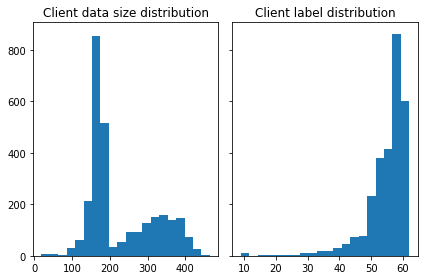

# Understand the Heterogeneous FL Data  

## Download the Femnist dataset and FedScale
Follow the download instruction in `./benchmark/dataset/download.sh` to download the FEMNIST dataset.

```{code-cell}
bash download.sh download femnist
```
[Install](../README.md) fedscale and import related libraries:

```sh
from torch.utils.data import DataLoader
import matplotlib.pyplot as plt
import numpy as np

# Make sure you have downloaded and installed FedScale
import fedscale.cloud.config_parser as parser
from fedscale.dataloaders.femnist import FEMNIST
from fedscale.dataloaders.utils_data import get_data_transform
from fedscale.dataloaders.divide_data import DataPartitioner
```


## Data Loader

```{code-cell}
train_transform, test_transform = get_data_transform('mnist')
train_dataset = FEMNIST('./benchmark/dataset/data/femnist', dataset='train', transform=train_transform)
test_dataset = FEMNIST('./benchmark/dataset/data/femnist', dataset='test', transform=test_transform)
```

Partition the dataset by the `client_data_mapping` file, which gives the real-world client-level heterogeneity.

```{code-cell}
parser.args.task = 'cv'
training_sets = DataPartitioner(data=train_dataset, args=parser.args, numOfClass=62)
training_sets.partition_data_helper(num_clients=None, data_map_file='./benchmark/dataset/data/femnist/client_data_mapping/train.csv')
#testing_sets = DataPartitioner(data=test_dataset, args=parser.args, numOfClass=62, isTest=True)
#testing_sets.partition_data_helper(num_clients=None, data_map_file='./benchmark/dataset/data/femnist/client_data_mapping/train.csv')
```


## Print and plot statistics of the dataset.

```{code-cell}
print(f'Total number of data samples: {training_sets.getDataLen()}')
print(f'Total number of clients: {training_sets.getClientLen()}')
```

> Total number of data samples: 637877
>
> Total number of clients: 2800

```{code-cell}
fig, axs = plt.subplots(1, 2, sharey=True, tight_layout=True)
size_dist = training_sets.getSize()['size']

n_bins = 20
axs[0].hist(size_dist, bins=n_bins)
axs[0].set_title('Client data size distribution')

label_dist = training_sets.getClientLabel()
axs[1].hist(label_dist, bins=n_bins)
axs[1].set_title('Client label distribution')

plt.show()
```



## Visualize the clients' data.

```{code-cell}
rank=1
isTest = False
dropLast =  True
partition = training_sets.use(rank - 1, isTest)
num_loaders = min(int(len(partition)/ parser.args.batch_size/2),  parser.args.num_loaders)
dataloader = DataLoader(partition, batch_size=16, shuffle=True, pin_memory=True, timeout=60, num_workers=num_loaders, drop_last=dropLast)
```

```{code-cell}
for data in iter(dataloader):
   plt.imshow(np.transpose(data[0][0].numpy(), (1, 2, 0)))
   break
```


