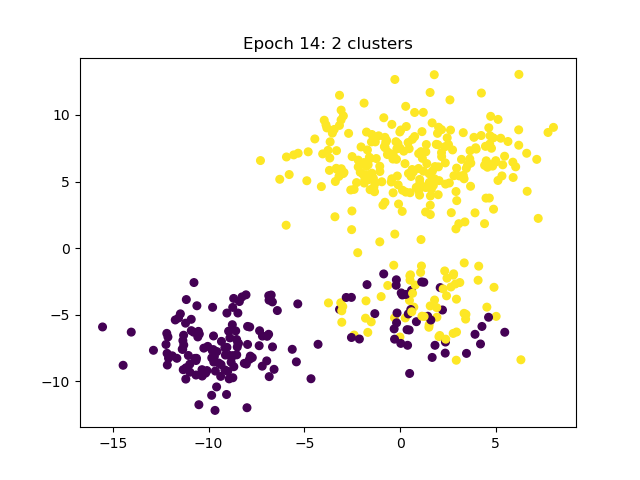
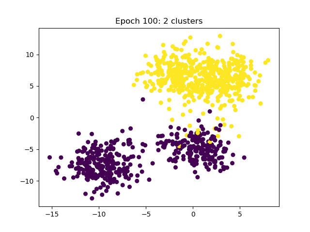
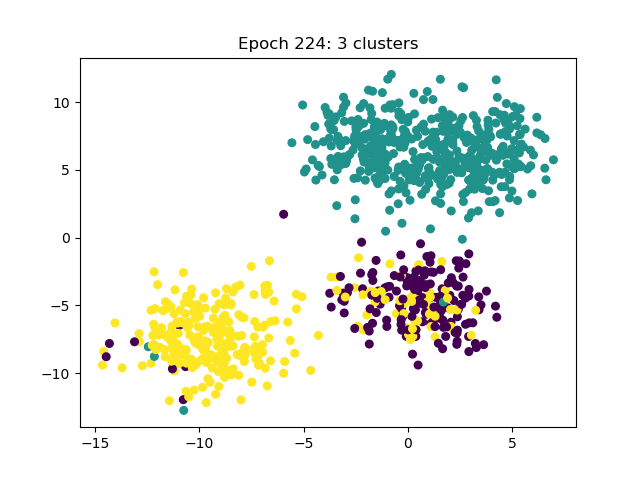
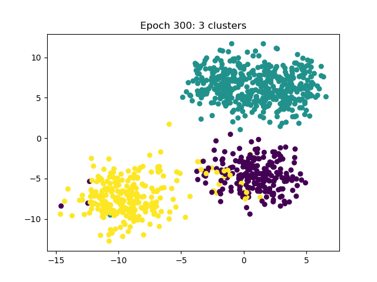
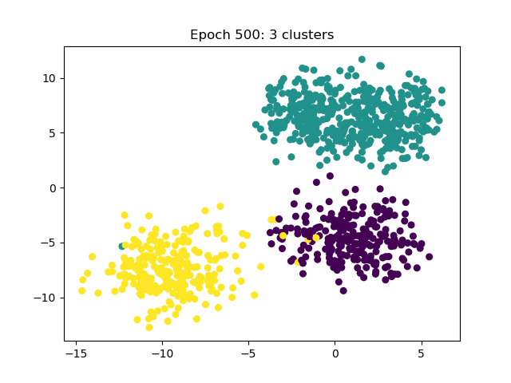
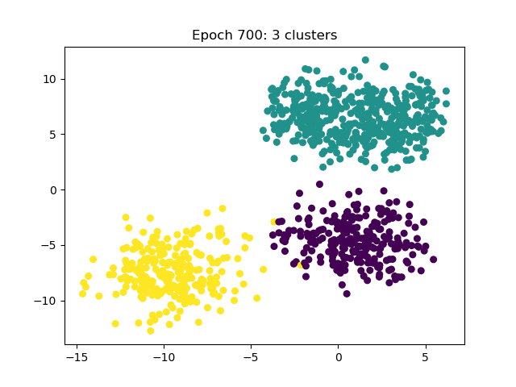

 

<div align="center">
<picture>
  
</picture> 
<h1>Auxo: Efficient Federated Learning via Scalable Client Clustering</h1>

</div>

Auxo is a heterogeneity manager in Federated Learning (FL) through scalable and efficient cohort-based training mechanisms.
For more details, refer to our academic paper on SoCC'23 [paper](https://arxiv.org/abs/2210.16656).


## Key Features

- **Scalable Cohort Identification**: Efficiently identifies cohorts even in large-scale FL deployments.
  
- **Cohort-Based Training**: Optimizes the performance of existing FL algorithms by reducing intra-cohort heterogeneity.

- **Resource Efficiency**: Designed to work in low-availability, resource-constrained settings without additional computational overhead.

- **Privacy Preservation**: Respects user privacy by avoiding the need for traditional clustering methods that require access to client data.


## Getting Started
### Install
Following the installation steps if you have not installed fedscale yet.
```commandline  
docker build -t fedscale:auxo .
docker run --gpus all -it --name auxo -v $FEDSCALE_HOME:/workspace/FedScale fedscale:auxo /bin/bash
```

```
echo export FEDSCALE_HOME=$(pwd) >> ~/.bashrc
echo alias fedscale=\'bash ${FEDSCALE_HOME}/fedscale.sh\' >> ~/.bashrc
source ~/.bashrc
```

### Prepare dataset
After setting up the fedscale environment, you can download the dataset and partition each client dataset into train set and test set.

```commandline
fedscale dataset download femnist
cd $FEDSCALE_HOME/examples/auxo 
python -m utils.prepare_test_train ../../benchmark/dataset/data/femnist/client_data_mapping/train.csv
python -m utils.prepare_test_train ../../benchmark/dataset/data/femnist/client_data_mapping/test.csv
python -m utils.prepare_test_train ../../benchmark/dataset/data/femnist/client_data_mapping/val.csv
```
### Run Auxo
```
cd $FEDSCALE_HOME
fedscale driver start benchmark/configs/auxo/auxo.yml 
```

### Visualize continuous clustering algorithm
```commandline
cd $FEDSCALE_HOME/examples/auxo
python playground.py
```
Visualized clustering Results: 

 <p float="left">
  
   
  
   
   
   
</p>

 