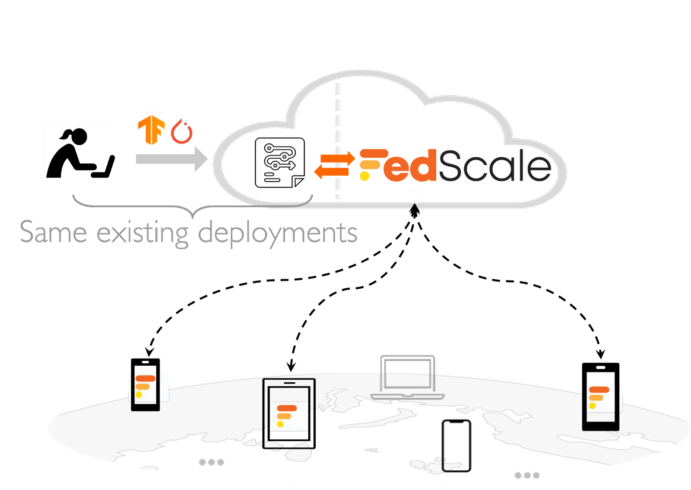

# FedScale Deployment

FedScale provides a cloud-based [aggregation service](https://github.com/SymbioticLab/FedScale/blob/master/fedscale/cloud/aggregation/README.md) and an [SDK](#fedscale-mobile-runtime) for smartphones on the edge that currently supports TensorflowLite and Alibaba MNN on Android (iOS support coming soon!). In this tutorial, we introduce how to:

- FedScale Deployment
  - [FedScale Cloud Aggregation](#fedscale-cloud-aggregation)
  - [FedScale Mobile Runtime](#fedscale-mobile-runtime)

<p align="center">

</p>


## FedScale Cloud Aggregation
FedScale cloud aggregation orchestrates distributed mobile devices to collaboratively train ML models over the Internet. It manages client check-in, participant selection, and model aggregation for practical FL deployment. 

FedScale deployment mode follows a setup similar to the [simulation mode](https://github.com/SymbioticLab/FedScale/blob/master/docs/tutorial.md) in order to streamline cloud-based prototyping and real-world deployment with little migration overhead. 

- **Configure job**: Jobs are configured in the `yml` format. Here is an [example](../../../benchmark/configs/android/tflite.yml): 

  ```
  job_conf:
      - job_name: android-tflite  
      - experiment_mode: mobile
      - log_path: $FEDSCALE_HOME/benchmark    # Path of log files
      - num_participants: 100                 # Number of participants selected in each training round
      - model: mobilenetv3                    # Model to be trained
      - data_path: assets/dataset             # Path to local database
      - input_shape: 32 32 3                  # Shape of training data stored in local database
      - num_classes: 10                       # Number of categories 
  ```

- **Submit job:** After figuring out the configuration, you can submit the FL training job to the cloud server, which will then automatically coordinate edge clients. 

  ```
  cd $FEDSCALE_HOME/docker
  # If you want to run MNN backend on mobile.
  fedscale driver submit $FEDSCALE_HOME/benchmark/configs/android/mnn.yml 
  # If you want to run TFLite backend on mobile.
  fedscale driver submit $FEDSCALE_HOME/benchmark/configs/android/tflite.yml 
  ```

- **Check logs:** FedScale will generate logs under the `data_path` specified in the configuration. If you use k8s deployment for cloud aggregation, keep in mind that k8s may load balance your job to any node in the cluster, so make sure you are checking the `data_path` on the correct node.

- **Stop job:** Once the logs indicate that the FL training has reached the target accuracy, you can stop FL training by submitting the following command to the cloud server.

  ```
  cd $FEDSCALE_HOME/docker
  fedscale driver stop $YOUR_JOB
  ```

## FedScale Mobile Runtime

If you don't have an app, you may refer to our [example Android app](README-App.md). Next, we introduce how to: 
- Train/test models with TFLite or Alibaba MNN.
- Fine-tune models locally **after** receiving model from the cloud.

To get started, you need to install the FedScale SDK and import it into your project.
Once you have installed the SDK, you can add ``fedScaleClient`` to your app with the following code to participate in federated learning or locally fine-tune the model: 

  ```
  import com.fedscale.android.Client;
  
  public class App {
      …
      private Client fedScaleClient;
      protected void onCreate() {
          …
          this.fedScaleClient = new Client(this);
          this.fedScaleClient.FLStart(); // run in background threads
      }
  }
  ```

When the user opens the app, ``fedScaleClient``'s internal scheduler will coordinate the device's resources with FedScale cloud to decide whether to start federated training (e.g., FedScale cloud is online) or to perform local fine-tuning (e.g., deeply personalize to the user). 

For ease of understanding, our [example app](README-App.md) plays with an image classification task within the app. Our example app puts training data under ``assets/TrainSet``. *Note that this data path of training data in the mobile devices is configurable when users submit jobs in the cloud to train or fine-tune a particular model (i.e., by updating ``- data_path`` in yml).* 

Our example app allows the user to choose when to start/stop FL and when to start local fine-tuning. If the user chooses to do local fine-tuning, they should click `Stop FL` button and click `Start Local Fine-tune` button. The FedScale SDK is extensible so that it can manage when to start and stop fine-tuning.

----
If you need any further help, feel free to contact FedScale team or the developer [website](https://continue-revolution.github.io) [email](mailto:continuerevolution@gmail.com) of this app.
